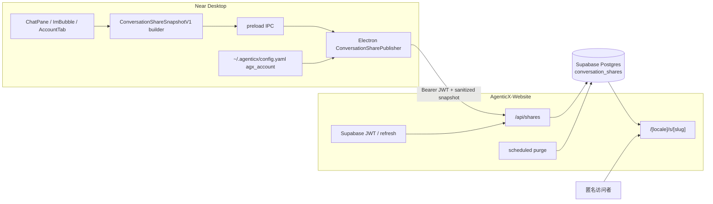
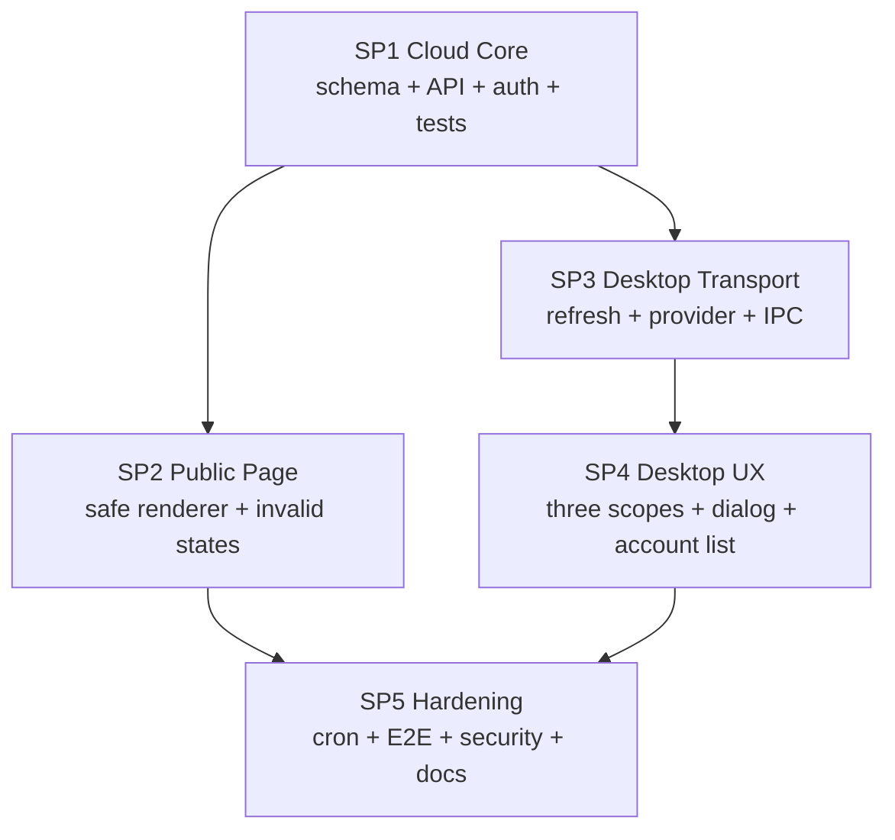

# Near 公网匿名对话分享 Master Plan

Planned-with: GPT-5.6 Sol  
Suggested-Impl-Model: Cursor Grok 4.5 High Fast  
Plan-Id: `2026-07-21-near-public-conversation-sharing`

## 目标

让 Near Desktop 用户把单轮问答、多选消息或完整会话发布为一个固定七天有效的公网匿名只读链接，例如：

```text
https://www.agxbuilder.com/s/<high-entropy-slug>
```

分享内容是创建时冻结的不可变快照，不依赖本机 `agx serve` 持续在线；用户可在 Near「设置 → 账号 → 我的分享」中复制或撤销链接。

## 为什么现状无法满足

证据链：

1. `../desktop/src/components/ChatPane.tsx` 已支持多选、复制、PDF 和 `POST /api/messages/forward`，但该转发只把消息写进另一个本地会话，不生成公网资源。
2. `../desktop/src/components/workspace/HtmlPreviewChrome.tsx` 的「复制链接」复制的是 HTML 预览 URL，不是聊天快照。
3. `../enterprise/apps/web-portal/src/components/MachiChatView.tsx` 拼接的 `/workspace?share=<messageId>` 没有创建 API、公开页面或数据库记录，且 `/workspace` 需要 Enterprise 登录。
4. Desktop 内嵌 `agx serve` 监听 `127.0.0.1`；即使增加本地 public route，外部用户仍无法访问。
5. `AgenticX-Website` 已有 Near 官网 Supabase Device Flow，Desktop 会把 `access_token` 与 `refresh_token` 写入 `~/.agenticx/config.yaml` 的 `agx_account`，是最短且身份边界正确的公网宿主。

## 已冻结产品决策

- 访问范围：公网匿名只读。
- 云端宿主：`AgenticX-Website + Supabase Postgres`。
- Desktop provider：首期只实现官网 provider，保留 `ConversationSharePublisher` 接口；Enterprise provider 后续另立计划。
- 分享范围：`turn`、`selection`、`session` 全部支持。
- 有效期：服务端固定七天，不提供期限选择。
- 附件：只显示文件名、MIME 类型、文件大小；不上传原文件、图片 data URL 或本地路径。
- 管理入口：Near「设置 → 账号 → 我的分享」展示有效链接，支持复制和撤销。
- 分享页：只读，不提供继续对话、评论、编辑或二次转发。
- 分享快照：仅保留公开可见的 user/assistant 正文；不公开系统提示、推理链、工具参数/结果或运行日志。

## In scope

- 官网分享表、迁移、认证 helper、创建/列表/匿名读取/撤销 API。
- 官网 Supabase refresh endpoint。
- 官网匿名只读分享页和安全 Markdown 渲染。
- Electron 主进程官网 share client、token refresh、IPC。
- Desktop 三种范围的快照构造、分享弹窗、入口和“我的分享”管理。
- 七天过期判定、撤销、清理任务、限额、错误码与端到端验证。

## Out of scope

- 不修改 `../agenticx/studio/server.py` 或本地 session 持久化协议。
- 不接通或修改 Enterprise Portal 的 share stub。
- 不实现 Enterprise tenant/device JWT provider；只保留窄接口。
- 不上传、托管或下载原始附件。
- 不公开 `<think>`、`reasoning`、tool call/result、system/notice/subagent progress。
- 不支持密码保护、指定收件人、访问统计、自定义到期时间、续期、公开搜索或 SEO 收录。
- 不重构 Near 现有 forward、PDF、消息操作或官网全站主题。

## 双仓交付边界

本地目录包含两个独立 Git 仓库，不能用一个 commit/worktree 覆盖：

- AgenticX 主仓：Website 仓的 sibling `..`，承载 Master、SP3、SP4、Desktop 代码与最终跨端证据。
- Website 独立仓：本计划所在仓根 `.`，承载镜像 Master、SP1、SP2、SP5 与官网代码。

Website-local 路径均相对本独立仓根书写，例如 `src/...`、`e2e/...`。AgenticX 主仓文件一律使用 sibling 路径，例如 `../desktop/...`、`../docs/...`、`../agenticx/...`、`../enterprise/...`。这些 sibling 文件只能由 AgenticX 主仓的配对 commit 落地；Website commit 不得包含它们，也不得假设两仓共享同一 Git 提交图。两仓通过相同 Plan-Id、协议版本、fixture 摘要和执行证据建立追踪关系。

开始实施前分别创建 plan-only bootstrap commit：

1. 主仓提交 `../.cursor/plans/` 下 Master + SP1–SP5。
2. Website 仓提交其 `.cursor/plans/` 下镜像 Master + SP1 + SP2 + SP5。
3. 两仓同名计划必须保持相同 Plan-Id；Website 计划的 `Plan-File` 指向 Website 仓自己的 `.cursor/plans/...`。
4. Website 完成 SP1 后，把其 commit SHA、部署环境和 `schemaVersion=1` 记录到主仓 `../.cursor/plans/2026-07-21-near-public-conversation-sharing.plan.md` 的“执行证据”段，创建主仓 `desktop-integration-baseline` evidence commit；禁止自造非白名单 git trailer。

SP2 从 Website 的 SP1 commit 创建 worktree；SP3 从 AgenticX 主仓 `desktop-integration-baseline` evidence commit 创建 worktree。两者不是同一 Git 提交图。

## 总体架构



关键边界：

- Renderer 永远拿不到 `access_token` 或 `refresh_token`。
- Renderer 只把版本化快照交给 IPC；Electron 主进程验证大小后上传。
- Website 对 Desktop 已清洗的快照再次执行 allowlist 校验，不能信任客户端。
- Website 存储的是冻结快照，不保存或读取本地 `session_id`。
- 匿名分享页不查询 Near 用户的其他数据。
- 公开正文按用户选择原样发布，可能本身含用户主动输入的敏感文本；系统只保证不会自动带入隐藏字段、本地附件内容和凭据。
- bearer slug 会出现在访问者浏览器历史以及 Vercel/CDN 受控 request-path 日志中；七天是公网访问 TTL，不是所有备份/平台日志的硬删除 SLA。

## 冻结协议：`ConversationShareSnapshotV1`

所有 subplan 必须使用下列字段语义；不得自行增加 live session、tool 或文件路径字段。

```ts
export type ConversationShareScope = "turn" | "selection" | "session";

export type ConversationShareAttachmentV1 = {
  name: string;       // 最长 255 字符
  mimeType: string;   // 最长 120 字符
  sizeBytes: number;  // 非负整数
};

export type ConversationShareMessageV1 = {
  id: string; // 快照内重新编号为 m1、m2……，不得复用本地 message id
  role: "user" | "assistant";
  content: string;
  createdAt?: string; // 有 timestamp 时转 ISO 8601；没有则省略
  senderLabel?: string; // 最长 80 字符；群聊/分身显示名
  attachments?: ConversationShareAttachmentV1[];
};

export type ConversationShareSnapshotV1 = {
  schemaVersion: 1;
  source: "near-desktop";
  scope: ConversationShareScope;
  title: string;      // 最长 160 字符
  capturedAt: string; // Desktop 创建快照时的 ISO 8601
  messages: ConversationShareMessageV1[];
};
```

### 范围算法

- `turn`：以被点击的 assistant 消息为终点，向前找到最近一条真实 user 消息；保留该 user 与其后直到目标 assistant 的公开 user/assistant 正文。忽略 `metadata.source=view_image_inject` 的伪 user、tool、notice、reasoning 和空占位。
- `selection`：按当前 `visibleMessages` 顺序处理用户勾选项；只保留 role 为 user/assistant 且有正文或附件 metadata 的消息。
- `session`：按当前窗格 `visibleMessages` 顺序处理全部消息，应用同一 allowlist。
- 三种范围最终都重新编号 `m1...mn`，禁止上传 `ownerSessionId`、`agentId`、本地 message id 或 `sourceSession`。

### 标题算法

1. 取快照第一条非空 user 内容。
2. 去除 Markdown 控制字符并折叠空白。
3. 截断为 60 个 Unicode 字符。
4. 无 user 正文时使用 `Near 对话分享`。

### 必须剥离的字段

`Message` 必须从零构造公开对象，禁止先 spread 再删字段。以下字段永远不能进入请求：

- `ownerSessionId`、`agentId`、`provider`、`model`
- `avatarUrl`、`quotedMessageId`
- `toolCallId`、`toolName`、`toolArgs`、`toolArgsPartial`
- `toolResultPreview`、`toolStreamLines`、`toolGroupId`
- `reasoning`、`reasoningSeconds`
- `inlineConfirm`、`clarificationPrompt`、`actionConfirmation`
- `metadata`、`subAgentCluster`、`forwardedHistory.sourceSession`
- attachment 的 `dataUrl`、`sourcePath`、`snippetContent`、`spreadsheetRef`、`htmlElementRef`

普通 Markdown URL 可保留在 `content` 中，但公开渲染必须只允许 `http:`, `https:`, `mailto:`，其他协议渲染为普通文本。

附件公开名必须经过 `sanitizePublicFilename()`：

1. 同时按 `/` 与 `\` 取 basename。
2. 剥离盘符、UNC、`@dir:` 路径载荷和 C0/C1 控制字符。
3. 空结果回落为 `附件`。
4. 最后截断为 255 个 Unicode 字符。

Desktop 与 Website 对同一 fixture 必须得到相同公开文件名。

## 服务端硬限制

- slug：`crypto.randomBytes(24).toString("base64url")`，约 192 bit 熵。
- 固定 TTL：`createdAt + 7 * 24 * 60 * 60 * 1000`；忽略客户端任何 expiry 字段。
- 每个账号最多 100 条未撤销、未过期分享；达到上限返回 429。
- 每个账号滚动 24 小时最多创建 50 条（含随后撤销的记录）；达到上限返回 429 `share_rate_limited` 和 `Retry-After`。
- 每个 snapshot 最多 200 条公开消息；不静默截断。
- 每条 message content 最多 65,536 字符。
- 每条消息最多 20 个附件 metadata。
- `JSON.stringify(snapshot)` 的 UTF-8 大小最多 1 MiB。
- 请求体在完整 `JSON.parse` 前按流读取并限制为 1.1 MiB；不能只信任 `Content-Length`。
- strict schema 先拒绝未知键；已知的 title/senderLabel/附件字符串再 trim、规范化和截断。message content 超限必须拒绝，不能截断正文。
- 创建请求带 UUID `clientRequestId`；`ownerUserId + clientRequestId` 唯一，重试返回已有记录，不重复创建。
- 匿名 public GET 与 refresh endpoint 必须在 Vercel Firewall/WAF 配置 IP 级速率限制；应用部署验收需保存规则证据。高熵 slug 不能替代 DoS 防护。

## 数据模型

在 `src/db/schema.ts` 新增：

```text
conversation_share_scope enum: turn | selection | session

conversation_shares
  id                uuid primary key default gen_random_uuid()
  public_slug       text not null unique
  owner_user_id     uuid not null
  client_request_id uuid not null
  schema_version    integer not null default 1
  source            text not null default 'near-desktop'
  scope             conversation_share_scope not null
  title             text not null
  snapshot          jsonb not null
  created_at        timestamptz not null default now()
  expires_at        timestamptz not null
  revoked_at        timestamptz nullable
```

约束与索引：

- unique `(owner_user_id, client_request_id)`
- index `(owner_user_id, created_at desc)`
- index `(owner_user_id, created_at)`，用于 24 小时创建计数
- index `(expires_at)`，用于分批清理
- public slug unique index
- migration 显式 `ENABLE ROW LEVEL SECURITY` 且不创建 anon/auth 直连 policy；所有读写只经 Website server route 的数据库连接。
- migration 使用 direct `MIGRATION_DATABASE_URL`（owner 角色）；Website runtime 使用独立的非 owner、`NOBYPASSRLS` 最小权限 login role 与 pooler `DATABASE_URL`。migration 为该 role 创建显式 RLS policy，并只授予 Website 所需表的 DML；`MIGRATION_DATABASE_URL` 禁止注入 Web runtime。验收需证明 runtime 路由可读写、不能 DDL/访问其他表，Supabase anon/auth 被拒绝。
- 不外键引用 Enterprise `users`，不写 Enterprise `chat_sessions`。

## HTTP 契约

origin 三态矩阵：

- production：只允许 `NEXT_PUBLIC_SITE_URL=https://www.agxbuilder.com`。
- staging/preview：必须配置一个固定 HTTPS `AGX_SHARE_STAGING_ORIGIN`，并与独立 staging Supabase/DB 绑定。
- local：只允许 `localhost` / `127.0.0.1` Request origin。

缺失或不匹配时创建 API失败；禁止生产/preview Host header fallback。packaged Desktop 只允许 production origin；非打包 staging build 只有在显式 `AGX_ALLOW_NON_PRODUCTION_ACCOUNT_ORIGIN=1` 时才接受完全相等的 staging origin。

### `POST /api/shares`

认证：`Authorization: Bearer <Supabase access token>`

请求：

```json
{
  "clientRequestId": "UUID",
  "snapshot": {
    "schemaVersion": 1,
    "source": "near-desktop",
    "scope": "turn",
    "title": "看一下这篇技术规范书",
    "capturedAt": "2026-07-21T00:00:00.000Z",
    "messages": []
  }
}
```

新建返回 201；同一 owner + clientRequestId 重放返回 200：

```json
{
  "ok": true,
  "share": {
    "slug": "opaque-base64url",
    "url": "https://www.agxbuilder.com/s/opaque-base64url",
    "title": "看一下这篇技术规范书",
    "scope": "turn",
    "createdAt": "2026-07-21T00:00:00.000Z",
    "expiresAt": "2026-07-28T00:00:00.000Z"
  }
}
```

### `GET /api/shares`

认证：Supabase bearer。只返回当前 owner 的未撤销且未过期记录，按 `createdAt DESC`；由于服务端限制 active share ≤100，首期一次返回全部，不分页，不返回 snapshot：

```json
{ "ok": true, "shares": [] }
```

### `GET /api/shares/[slug]`

匿名。返回 `{ "ok": true, "share": { ...summary, "snapshot": {} } }`。必须设置 `Cache-Control: private, no-store, max-age=0, must-revalidate`。

- active：200
- expired 且数据库记录尚未 purge：410 + `{ ok:false, error:"share_expired" }`
- expired 记录被 purge 后：按 unknown 返回 404
- unknown/revoked：404 + `{ ok:false, error:"share_not_found" }`

### `DELETE /api/shares/[slug]`

认证：Supabase bearer。只允许 owner；使用条件更新设置 `revoked_at`。

- 首次撤销：200 + `{ "ok": true, "revoked": true }`
- 同 owner 重复撤销且记录尚未到期/purge：200，保持幂等
- 到期记录被 purge 后重复撤销：404
- 非 owner 或不存在：统一 404，不泄露记录归属

### `POST /api/auth/device/refresh`

请求 `{ "refresh_token": "..." }`。Website 调用 Supabase `auth.refreshSession()`，返回新 `access_token`、轮换后的 `refresh_token` 与 `expires_at`。响应必须 `no-store`，禁止记录 token。

Desktop 上传/list/revoke 遇到 401 时：

1. 调 refresh endpoint 一次。
2. 原子写回 `agx_account.access_token` / `refresh_token` / `updated_at`。
3. 原请求只重试一次。
4. 主进程内并发 401 共用 single-flight refresh promise。
5. refresh 明确返回 401 `invalid_refresh_token` 时，以旧 refresh token 做 compare-and-swap 清除。
6. refresh 成功提交新 credential generation 后，原请求只重试一次；若仍 401，以新 generation 做 compare-and-swap 清除。
7. CAS 保存失败表示登录期间退出/切换账号，立即返回 `auth_context_changed`，不得拿旧账号刷新结果重试。
8. timeout/5xx 保留凭据并返回服务暂不可用，不得循环。

## 公开页面契约

路径：`src/app/[locale]/s/[slug]/page.tsx`。Middleware 会把 `/s/<slug>` rewrite 到默认中文路径，英文显式路径为 `/en/s/<slug>`。

页面必须：

- Server Component 直接调用 share service/store，避免从服务端 self-fetch。
- active 时显示标题、分享时间、失效时间、只读消息和附件 metadata。
- unknown/revoked/expired 统一显示不含内部细节的“链接已失效或不存在”页面。
- Metadata 设置 `robots: { index: false, follow: false }`。
- 不显示 owner email、user id、clientRequestId、public API payload 或错误堆栈。
- 专用 Markdown renderer 不启用 raw HTML；链接只允许安全协议并带 `rel="noopener noreferrer nofollow"`。
- Markdown 图片语法不发起第三方请求，只显示不可点击文本占位；share route 设置 `Referrer-Policy: no-referrer`。
- active/invalid/error HTML 都显式使用 `Cache-Control: private, no-store, max-age=0, must-revalidate`。
- 附件卡明确显示“原文件未公开”。
- 不提供继续对话或登录 CTA，避免扩大首期范围。

## 错误码

Website API 使用稳定机器码，Desktop 映射为中文提示：

- `missing_bearer_token`
- `invalid_session`
- `invalid_refresh_token`
- `invalid_share_payload`
- `share_payload_too_large`
- `share_message_limit_exceeded`
- `share_limit_reached`
- `share_rate_limited`
- `share_not_found`
- `share_expired`
- `share_service_unavailable`
- `auth_required`（Desktop 聚合码）
- `auth_context_changed`（Desktop 登录期间退出/切换账号）

状态映射固定为：

- 普通 schema 错误：400 `invalid_share_payload`
- 超过 200 条：400 `share_message_limit_exceeded`
- body/snapshot 超过限制：413 `share_payload_too_large`
- active 上限：429 `share_limit_reached`
- 24 小时创建上限：429 `share_rate_limited` + 秒数形式 `Retry-After`；SP3 经 IPC 透传为 `retryAfterSeconds`

应用主动日志可以记录 request id、HTTP status 与错误码，但不得主动记录 slug、snapshot、access/refresh token 或消息正文。Vercel/CDN 的 request path 会包含 bearer slug；部署侧必须限制日志访问/导出权限并记录平台保留策略，不能宣称平台日志中绝无 slug。

## 实现 DAG 与文件包



| 子计划 | 文件 | Suggested-Impl-Model | 原因 |
|---|---|---|---|
| SP1 | `.cursor/plans/2026-07-21-near-share-cloud-core.plan.md` | Cursor Grok 4.5 High Fast | 后端 schema/API 边界清晰，适合按契约实现 |
| SP2 | `.cursor/plans/2026-07-21-near-share-public-page.plan.md` | Cursor Grok 4.5 High Fast | 单一 Next.js 页面域，视觉要求克制 |
| SP3 | `../.cursor/plans/2026-07-21-near-share-desktop-transport.plan.md` | Cursor Grok 4.5 High Fast | Electron 与 token 生命周期敏感，但精确 plan 可控；由主仓配对 commit 落地 |
| SP4 | `../.cursor/plans/2026-07-21-near-share-desktop-ux.plan.md` | Cursor Grok 4.5 High Fast | 主要为现有交互接线与纯函数；由主仓配对 commit 落地 |
| SP5 | `.cursor/plans/2026-07-21-near-share-hardening.plan.md` | GPT-5.6 Sol（推荐复核）；实现可继续用 Cursor Grok 4.5 High Fast | 跨栈安全与回归收口需要独立强推理复核 |

## Grok 4.5 执行规则

1. 每次只向 Grok 提供本 Master Plan + 当前一个 subplan；不要把五个实现任务一次塞入同一上下文。
2. 先完成“双仓交付边界”中的两个 plan-only bootstrap commit。
3. SP1 必须在 Website 仓先完成、验证并提交，冻结 API/fixture。
4. Website SP1 完成后，先在主仓 sibling Master 写入其 SHA/deployment/API v1/fixture hash 并创建 `desktop-integration-baseline` evidence commit。
5. SP2 从 Website SP1 commit 建 worktree；SP3 从主仓 evidence commit 建 worktree。两者可并行实现，但不是同一 Git 基线。
6. SP4 只能在 SP3 合入后执行。
7. SP5 只能在 SP2、SP4 都通过各自测试后执行。
8. 每个 subplan 只能修改其 `In scope files`；发现契约缺口先停下更新两仓 Master Plan，禁止在代码里私自漂移协议。
9. 每个 subplan 独立提交；plan 文件必须与对应代码位于同一仓库分支，并使用该仓自己的 `Plan-Id` / `Plan-File` trailer。
10. 每阶段先写失败测试，再实现，再跑定向测试与该应用 build。

发布 DAG 与实现 DAG 不同：SP2 公开页必须先部署且匿名 smoke 通过，才允许发布含 SP4 分享入口的 Desktop。SP4 可以在 SP2 并行开发，但不能先交付给终端用户。

## 执行证据

实施时维护以下非 trailer 字段：

```text
Website plan bootstrap commit:
Website SP1 commit:
Website staging deployment:
API schema version: 1
Website fixture SHA-256:
Desktop fixture SHA-256:
Desktop plan bootstrap commit:
SP2 anonymous smoke:
```

## 全局验收标准

- AC-1：未登录 Near 点击任一分享入口时不上传数据，明确引导官网账号登录。
- AC-2：`turn`、`selection`、`session` 均能生成公网 URL；链接从无登录浏览器可打开。
- AC-3：公开页消息顺序、角色和 Markdown 可读；附件只显示 metadata。
- AC-4：创建后本地会话继续变化，既有公开快照内容不变。
- AC-5：服务端生成的 `expiresAt` 恰为创建时间加七天；过期后公开内容不可取回。
- AC-6：Near“我的分享”展示全部 active links；复制可用；撤销后页面立即失效。
- AC-7：重复 `clientRequestId` 不产生第二条记录。
- AC-8：系统不会从隐藏字段自动带入 system、reasoning、tool 参数/结果、附件路径/内容或官网账号 token；确认弹窗明确提示用户所选可见正文、显示名、时间与附件文件名将原样公开。
- AC-9：access token 过期时并发请求共用一次 refresh；原请求只重试一次。无效 refresh 或新 generation 重试仍 401 才按对应 generation 清除；账号切换终止旧请求，网络/5xx 不强制登出。
- AC-10：Website 创建/list/delete 均按 owner 隔离；用户 A 不能列出或撤销用户 B 的链接。
- AC-11：公开页对 Markdown raw HTML、`javascript:` URL 和脚本 payload 不执行。
- AC-12：SP1–SP5 指定的测试、`AgenticX-Website` typecheck/lint/build 与 Desktop Vitest/build 全绿。
- AC-13：`../agenticx/studio/server.py`、`../enterprise/**` 与现有 `/api/messages/forward` 没有改动。
- AC-14：公开页面、refresh 响应和 API 均无缓存；Markdown 图片不发第三方请求。
- AC-15：Website runtime DB 角色、migration direct URL、WAF rate-limit 与 request-path 日志访问策略均有 staging 证据。

## 总体验证命令

各 subplan 提供更小的定向命令；最终至少执行：

```bash
pnpm test:shares
pnpm ts-check
pnpm lint
pnpm build

npm --prefix ../desktop exec vitest run \
  src/utils/conversation-share.test.ts \
  src/components/messages/ImBubble.test.tsx \
  src/components/shares/ConversationShareDialog.test.tsx \
  src/components/shares/AccountSharesSection.test.tsx \
  tests/agx-share-client.test.ts
npm --prefix ../desktop run build
```

其中 `../desktop/**` 的测试与实现由 AgenticX 主仓配对 commit 负责；Website commit 只运行并记录跨仓验证结果，不包含 sibling 文件改动。

SP5 还必须针对本地 Website + 测试数据库执行真实 HTTP 链：

```text
登录 token → POST create → 匿名 GET 200 → owner list 可见
→ DELETE revoke → 匿名 GET 404 → 到期前再次 DELETE 200
```

并用时间注入测试七天边界，不允许测试真实等待。

## 部署与回滚

- 先由 migration owner 执行 runtime role bootstrap，再运行 DB migration/grant/RLS policy；随后部署 Website API/page，最后发布 Desktop。旧 Desktop 不受新表影响。
- Website API 未部署时 Desktop 必须显示“分享服务暂不可用”，不能影响聊天、转发或账号登录。
- 公开页 SP2 未部署并通过匿名 smoke 前，不发布 SP4 Desktop 入口。
- 回滚 Desktop 只需撤销入口和 IPC；已有分享仍由 Website 读到过期。
- 回滚 Website 代码前不能先删表；保留 API 只读/撤销能力直到 active share 全部过期。
- 撤销记录保留到原 `expires_at` 以维持 TTL 内幂等；清理任务只分批删除 `expires_at <= now()` 的记录，禁止碰 active share 或 `device_auth_requests`。
