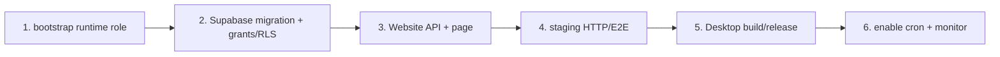

# Near Share SP5：跨端验收、安全与部署收口

Planned-with: GPT-5.6 Sol  
Suggested-Impl-Model: GPT-5.6 Sol（最终复核）；实现可使用 Cursor Grok 4.5 High Fast  
Plan-Id: `2026-07-21-near-share-hardening`  
Parent-Plan: `.cursor/plans/2026-07-21-near-public-conversation-sharing.plan.md`  
Depends-On:

- `.cursor/plans/2026-07-21-near-share-public-page.plan.md`
- `../.cursor/plans/2026-07-21-near-share-desktop-ux.plan.md`（AgenticX 主仓配对计划）

## 目标

在 SP1–SP4 全部通过后，补齐自动清理、跨端 E2E、安全回归、错误码文档和部署/回滚验证，证明 Near 从本机创建到匿名访问、撤销和过期的完整链路可用且不泄露敏感字段。

## 双仓路径约定

- Website-local 文件均相对本独立仓根书写，例如 `src/...`、`e2e/...`、`vercel.json`。
- AgenticX 主仓文件使用 sibling 路径，例如 `../desktop/...`、`../docs/...`、`../agenticx/...`、`../enterprise/...`。
- Website 的 cron/E2E/Vercel 改动由 Website commit 落地；Desktop、主仓 docs 和跨端证据由 AgenticX 主仓配对 commit 落地。相同 Plan-Id 只建立追踪关系，不能假设两仓使用同一 git commit。

## 前置条件

- SP1 schema/API/refresh 已合入并通过 Website build。
- SP2 公开页面已合入。
- SP3 Electron provider/IPC 已合入。
- SP4 三范围 UX 与账号分享管理已合入。
- 本计划不用于补做未完成的 SP1–SP4；发现前置缺失应退回对应 subplan。

## In scope files

新增：

- `src/app/api/internal/shares/purge/route.ts`
- `src/app/api/internal/shares/purge/__tests__/route.test.ts`
- `playwright.config.ts`
- `e2e/share-api-fixture.ts`
- `e2e/share-flow.spec.ts`
- `scripts/test-shares-e2e-local.sh`
- `vercel.json`
- AgenticX 主仓 `../docs/verification/near-share-staging-acceptance.md`（由主仓配对 commit 落地）

修改：

- `.env.example`
- `package.json`
- `pnpm-lock.yaml`
- AgenticX 主仓 `../docs/error-codes.md`（由主仓配对 commit 落地）

集成测试发现 SP1–SP4 缺陷时停止 SP5，回到所属 subplan 补充精确 In scope 路径并按所属 Plan-Id 修复；SP5 不拥有任意修改前置文件的 blanket 权限。

## Out of scope

- 不增加新产品能力。
- 不增加访问统计、密码、期限选择或附件托管。
- 不接 Enterprise provider。
- 不修改 `../agenticx/studio/server.py`。
- 不做生产数据迁移回填；该表是全新表。

## Task 1：清理 API TDD

Vercel Cron 调用 GET，因此新增：

```text
GET /api/internal/shares/purge
Authorization: Bearer <CRON_SECRET>
```

先写 route test：

- 未配置 `CRON_SECRET` → 503，repository 未调用。
- 无 Authorization → 401。
- 错误 token → 401。
- 正确 token → 调 `getProductionConversationShareService().purgeExpired(500)`，最多循环 20 批。
- 响应只含 `{ ok:true, deleted:<number>, hasMore:<boolean> }`，不含 slug/title/snapshot。
- 日志不含 token。

鉴权比较：

- 从 `process.env.CRON_SECRET` 读取。
- 使用 Node `crypto.timingSafeEqual`；长度不同直接拒绝。
- 不支持 query-string secret。

repository 清理条件必须是：

```sql
expires_at <= now
```

撤销记录保留到原 `expires_at`，保证 TTL 内重复 DELETE 幂等；不能删除未到期 revoked、active share 或 `device_auth_requests`。每批最多 500 条，单次 cron 最多 10,000 条并设置运行时上限，避免全表长事务。

运行：

```bash
pnpm exec vitest run \
  src/app/api/internal/shares/purge/__tests__/route.test.ts
```

## Task 2：Vercel Cron 与环境文档

在 `.env.example` 新增：

```dotenv
# Vercel Cron 调用 /api/internal/shares/purge 的 bearer；生产必须为高熵随机值
CRON_SECRET=
```

新增 `vercel.json`：

```json
{
  "crons": [
    {
      "path": "/api/internal/shares/purge",
      "schedule": "17 3 * * *"
    }
  ]
}
```

约束：

- 此文件只适用于 Vercel Project Root=`.`（本 Website 独立仓根）。
- AgenticX 主仓 sibling `../vercel.json` 是 MkDocs 构建配置，禁止修改。
- 部署前在 Vercel 项目设置确认 Root Directory；否则 cron 配置不会生效。
- cron 只是物理清理，公开 API 仍必须实时执行 expired/revoked 判断，不能依赖 cron 才失效。
- purge route test 路径必须加入 `test:shares` script，确保最终统一命令会运行它。
- 按 `expires_at ASC` oldest-first 删除；`hasMore=true` 时应用日志发出不含 slug/正文的 backlog warning，并接入部署告警。每日 10,000 条清理容量、backlog 数量和预计清零天数写入 staging 证据。公开访问仍由 read path 在 expiresAt 立即拒绝，不依赖物理清理。

同时在 Website Vercel Firewall/WAF 使用一条可在最低 entitlement 下落地的规则：

- 覆盖 GET/HEAD `/api/shares/<slug>`、`/s/*`、`/en/s/*`，以及 share create/list/delete 与 device refresh 路径。
- 每 IP 60 次/分钟；staging 分别验证中文、英文、HEAD 和 API 都命中同一规则。
- WAF 429 不承诺 `Retry-After`；Desktop 对无机器码/header 的 429 显示通用限流提示。
- 应用内 owner 24h 限额仍返回精确秒数 `Retry-After`。

WAF 是部署配置，不在仓库伪造一个进程内 Map 限流器；规则截图/导出与环境标识写入 staging acceptance 文档。

## Task 3：Playwright E2E 基础

安装最新兼容测试依赖：

```bash
pnpm add -D @playwright/test
pnpm exec playwright install chromium
```

在 `package.json` 增加：

```json
{
  "scripts": {
    "test:shares": "vitest run src/lib/shares src/components/shares src/app/api/shares src/app/api/auth/device/refresh src/app/api/internal/shares --exclude '**/*.integration.test.ts'",
    "test:shares:e2e:setup": "tsx tests/setup-share-test-db.ts",
    "test:shares:e2e": "playwright test e2e/share-flow.spec.ts",
    "test:shares:e2e:local": "bash scripts/test-shares-e2e-local.sh"
  }
}
```

`playwright.config.ts`：

- 默认读取 `SHARE_E2E_BASE_URL`，本地 fallback `http://127.0.0.1:5000`，与现有 `scripts/dev.sh` 一致。
- Chromium only。
- 本 share suite 的 trace/video/screenshot 全部关闭，避免把 bearer、slug 或正文写入 CI artifact。
- 不在 config 打印 token/env。
- DB-mutating E2E 强制 `SHARE_E2E_START_SERVER=1`，`webServer.command="pnpm dev"`、`url=http://127.0.0.1:5000`、`reuseExistingServer=false`；把 guarded test URL 显式注入子进程 `DATABASE_URL`。
- 远程 write E2E 只允许与 `SHARE_E2E_ALLOWED_STAGING_ORIGIN` 完全相等的固定 staging host，并硬拒绝 `www.agxbuilder.com`/production Supabase issuer；production smoke 只能匿名只读，不能 create/delete。

E2E 专用环境变量：

```text
SHARE_E2E_BASE_URL
SHARE_E2E_ACCESS_TOKEN
SHARE_E2E_ALLOWED_STAGING_ORIGIN
SHARE_TEST_DATABASE_URL
SHARE_TEST_ALLOW_DB_WRITE=1
SHARE_TEST_EXPECTED_DATABASE
```

复用 SP1 的 `tests/helpers/share-test-db-guard.ts` 与 `tests/setup-share-test-db.ts`，不新建第二套 guard：

1. base URL 必须是 localhost/127.0.0.1，且硬拒绝 `www.agxbuilder.com`。
2. `SHARE_TEST_ALLOW_DB_WRITE` 必须严格等于 `1`。
3. 连接后 `SELECT current_database()` 必须等于 `SHARE_TEST_EXPECTED_DATABASE` 且以 `_test` 结尾。
4. `test:shares:e2e:setup` 在前述 guard 通过后创建/更新 test-only `share_e2e_sentinel(environment='test')`；E2E 正式开始前再次校验 sentinel。
5. 本地 Website 进程的 `DATABASE_URL` 明确设置为同一个 `SHARE_TEST_DATABASE_URL`。
6. `SHARE_E2E_ACCESS_TOKEN` 必须由该本地 Website 配置的同一 Supabase test project 签发。
7. direct cleanup 只按本次 `owner_user_id + client_request_id` 删除，禁止全表 marker 模糊删除。

任何条件不满足都在发起 DB 写入前 fail closed。不得对 production/staging 直接造过期行。

`scripts/test-shares-e2e-local.sh` 使用 `set -Eeuo pipefail`，要求调用方一次性 export：

```text
SHARE_TEST_DATABASE_URL
SHARE_TEST_EXPECTED_DATABASE
SHARE_TEST_ALLOW_DB_WRITE=1
SHARE_E2E_ACCESS_TOKEN
CRON_SECRET
```

脚本在同一环境中依次执行：

1. `pnpm test:shares:e2e:setup`：preflight 后创建固定 NOLOGIN test runtime role、应用 Drizzle migrations、创建/校验 sentinel。
2. `pnpm test:shares:integration`。
3. 设置 `DATABASE_URL="$SHARE_TEST_DATABASE_URL"`、`SHARE_E2E_START_SERVER=1`、`SHARE_E2E_BASE_URL=http://127.0.0.1:5000` 后运行 Playwright。

任一步失败立即退出；不得要求前一条独立 shell 命令“遗留”环境给后一条。

## Task 4：真实 HTTP + Browser 链路

`e2e/share-flow.spec.ts` 使用唯一 marker，例如：

```text
near-share-e2e-<uuid>
```

所有带 access token/cron secret 的 create/list/revoke/purge setup 与 teardown 放在 `share-api-fixture.ts`，使用原生 Node fetch，且不进入 Playwright browser trace。浏览器只访问匿名页面；测试输出、标题和 assertion message 不打印完整 slug/token。

完整测试：

1. `POST /api/shares` 无 bearer → 401。
2. 带测试 bearer 创建 turn snapshot → 201，断言 `expiresAt-createdAt = 604800000ms`。
3. 同一 `clientRequestId` 重放 → 200 且 slug 相同。
4. `GET /api/shares` 只出现一条 marker 记录。
5. 无 cookie/bearer打开 `/s/<slug>`：
   - 状态 200
   - marker 可见
   - “原文件未公开”可见
   - 页面没有登录 redirect
   - `Cache-Control` 为 no-store、`Referrer-Policy=no-referrer`
   - `Age`/`x-vercel-cache` 不得表明 HIT
6. 页面 response headers/HTML 不含 token、owner user id、clientRequestId。
7. `DELETE /api/shares/<slug>` → 200。
8. 再次匿名 API GET → 404。
9. 再次打开页面 → 通用无效态，marker 不再出现在 HTML。
10. 重复 DELETE → 200。

teardown 按模式冻结：

- 本地 DB-mutating suite：`finally/afterAll` 按 owner + clientRequestId 直接删除本次记录。
- 远程 allowlisted staging suite：只调用 revoke 并验证匿名 404，接受记录保留到 expiresAt。
- production base 即使提供看似有效 token也必须在 fetch 前 fail closed；production 只允许匿名 read-only smoke。

## Task 5：过期与 purge 集成

在测试数据库直接插入一条：

- valid 32-char slug
- `expires_at` 为过去
- snapshot 带唯一 marker

验证：

- public API → 410。
- 页面 → 通用无效态，不显示 marker。
- 调 purge → deleted ≥1。
- public API 再查 → 404。

不通过测试专用公开 endpoint 修改时间；直接 DB helper 只存在于 E2E 测试目录。

## Task 6：安全回归矩阵

创建 snapshot 内容：

```markdown
<script>window.__nearShareXss = true</script>
[bad](javascript:window.__nearShareXss=true)
[file](file:///Users/example/secret)
正常链接：https://example.com

```

浏览器断言：

- `window.__nearShareXss` 为 `undefined`。
- DOM 无 `script` 内容节点。
- 无 `href^="javascript:"`、`href^="file:"`、`href^="data:"`。
- 正常 HTTPS link 有安全 rel。
- 页面没有向 `third.example` 或其他 Markdown image origin 发请求。

创建带下列额外字段的原始 POST：

```text
reasoning
toolArgs
sourcePath
dataUrl
ownerSessionId
metadata
```

Website strict contract 必须返回 400，而不是静默存储。

再使用 Desktop builder fixture 创建合法 payload，把以下字符串只放在隐藏字段/attachment path（不要放进用户可见正文），断言公开 API/HTML 不出现：

```text
/Users/
C:\\Users\\
<think>
toolArgs
data:image/
refresh_token
access_token
```

另加一条用户正文主动包含 `/Users/demo` 的 fixture，确认弹窗预览会明确展示并按用户选择原样公开；测试结论必须区分“隐藏字段自动泄漏”与“用户选择发布的可见正文”。

## Task 7：Desktop 手工跨端验收

因 Electron UI 流程依赖本地 app，SP5 必须记录一轮完全重启后的验收结果：

```text
1. Near 官网账号登录成功。
2. assistant 气泡分享 turn，匿名窗口内容正确。
3. 多选分享 selection，顺序正确。
4. 顶栏分享 session，消息数正确。
5. 含 DOCX/PDF 的消息只显示 metadata。
6. 账号页“我的分享”出现三条记录。
7. 复制链接可粘贴。
8. 撤销其中一条，匿名窗口刷新后失效。
9. 模拟 access token 过期，refresh 后创建成功。
10. 模拟 refresh token 失效，UI 提示重新登录且不循环请求。
```

手工验收不得修改真实生产账号数据；使用测试/预发布环境。

结果写入 AgenticX 主仓 `../docs/verification/near-share-staging-acceptance.md`，由主仓配对 commit 落地：

- 环境标识、日期、Website commit/deployment、Desktop commit/build。
- 每条 AC 的 PASS/FAIL 与脱敏证据位置。
- WAF 规则、runtime DB role、RLS、cron、no-store header 检查结果。
- 数据保留矩阵：主表按每日 best-effort purge（记录 backlog/预计清零天数）、Supabase backup/PITR、Vercel request-path logs、CI artifacts 的责任方与实际保留策略。
- 明确七天只承诺公网访问 TTL，不承诺所有介质在第七天物理删除；平台日志/备份按平台策略保护，恢复备份后仍按 expires/revoked 拒绝并重新 purge。
- 禁止写 token、完整 slug、用户消息正文或真实附件名。

## Task 8：错误码文档

在 AgenticX 主仓 `../docs/error-codes.md` 增加“Near 公网分享”段，由主仓配对 commit 落地：

- 列出 Parent Plan 稳定机器码。
- 给出用户文案、HTTP status、建议动作。
- 不写数据库路径、token 格式或生产 secret。
- 明确 `share_not_found` 同时覆盖不存在/非 owner/已撤销，以避免泄露。

不得修改与本功能无关的旧错误码。

## Task 9：全量验证与 diff 审计

Website：

```bash
pnpm test:shares
pnpm ts-check
pnpm lint
pnpm build
# 先 export SP5 列出的五个必填测试变量
pnpm test:shares:e2e:local
```

Desktop（由 AgenticX 主仓配对 commit 执行并记录）：

```bash
npm --prefix ../desktop exec vitest run \
  src/utils/conversation-share.test.ts \
  src/components/messages/ImBubble.test.tsx \
  src/components/shares/ConversationShareDialog.test.tsx \
  src/components/shares/AccountSharesSection.test.tsx \
  tests/agx-share-client.test.ts
npm --prefix ../desktop run build
```

最终 diff 审计：

```text
../agenticx/studio/server.py 无 diff
../enterprise/** 无 diff
现有 /api/messages/forward 无行为改动
现有 device init/confirm/poll 测试/手工 smoke 仍通过
应用主动日志不含 token、slug、snapshot 或消息正文
Vercel/CDN request-path 会含 slug；其访问权限、log drain 与保留策略已核验并记录
```

## 部署顺序



部署检查：

- migration owner 先执行：

```bash
psql "$MIGRATION_DATABASE_URL" -v ON_ERROR_STOP=1 \
  -f scripts/provision-share-runtime-role.sql
pnpm db:migrate
```

- role bootstrap 只创建固定 NOLOGIN/NOBYPASSRLS group role；实际 pooler login role 的密码在平台 secret 中管理并被授予该 group role，禁止写入 SQL/仓库。
- runtime role 已按 SP1 provision：non-owner、NOBYPASSRLS、最小 DML、不能 DDL；RLS policy 可用且 anon/auth 被拒绝。
- Vercel Web runtime 只配置 runtime `DATABASE_URL`、Supabase env、`NEXT_PUBLIC_SITE_URL`、`CRON_SECRET`；owner `MIGRATION_DATABASE_URL` 只存在受保护 migration job，禁止注入 Web runtime。
- production/staging/local origin 符合 Parent Plan 三态矩阵；staging 使用固定 HTTPS origin 与独立 Supabase/DB。
- `${AGX_SHARE_STAGING_ORIGIN}/s/<staging-slug>` HTTPS 正常；production 域只做匿名 read-only smoke。
- Vercel Cron 能收到 200；错误响应不触发误删。
- 单条 Vercel WAF 规则覆盖中英文 page/API/refresh 并返回 429；只有应用内 owner 限额承诺 Retry-After。
- request-path 日志权限与保留策略已记录；不宣称平台日志不含 slug。
- Website 先于 Desktop 发布，避免新版 Desktop 请求不存在的 API。

## 回滚

- Desktop 回滚：移除入口/IPC 不影响已发布链接。
- Website UI 回滚：保留 public API/page 的无效态和撤销 API，直到 active shares 过期。
- API 回滚：不能先 drop table；先停止新建，保持读/撤销七天以上。
- migration 回滚必须在确认表内没有 active record 后单独执行。
- cron 故障只暂停物理清理；实时过期/撤销仍由 read path 保证。

## AC

- AC-SP5-1：真实 bearer create → 匿名页面 → owner list → revoke → 匿名失效链路全自动通过。
- AC-SP5-2：七天边界由 fake clock + 过期 DB fixture 双重验证。
- AC-SP5-3：cron 分批只删 expired；未到期 revoked 保留到 expiresAt，鉴权失败不执行删除。
- AC-SP5-4：XSS、危险 URL、Markdown remote image 不执行/发网；隐藏路径、推理链、tool、附件内容不被系统自动带入。
- AC-SP5-5：Desktop 三种 scope 与账号管理经完全重启手工验证。
- AC-SP5-6：Website 全套检查、E2E 与 Desktop tests/build 全绿。
- AC-SP5-7：错误码文档完整且不暴露内部实现。
- AC-SP5-8：部署顺序和回滚在 staging 演练记录中可复现。
- AC-SP5-9：Studio、Enterprise 与 forward 无 diff。
- AC-SP5-10：DB-mutating E2E 仅在本地 sentinel test DB 运行，生产/staging fail closed。
- AC-SP5-11：WAF、缓存、日志访问和数据保留矩阵有脱敏验收证据。
- AC-SP5-12：远程 write E2E 只允许固定 staging origin，production base 在 fetch 前拒绝；remote teardown 仅 revoke。
- AC-SP5-13：WAF 同时覆盖 `/s/*`、`/en/s/*`、HEAD 与 API，WAF 429 不虚构 Retry-After。
- AC-SP5-14：daily purge oldest-first；hasMore 触发告警并记录 backlog 与预计清零天数。

## 提交边界

SP5 是双仓收口：

- Website 仓提交 cron/E2E/Vercel 配置与 Website 本地镜像 plan。
- AgenticX 主仓配对 commit 提交 `../docs/error-codes.md`、`../docs/verification/near-share-staging-acceptance.md` 与主仓 plan 修订。

两边使用同一 Plan-Id，但各自 `Plan-File` 指向本仓文件。两仓提交不是同一个 Git commit；Website commit 不得包含 `../desktop/**` 或 `../docs/**`。若发现 SP1–SP4 缺陷，退回所属 subplan 修复后重新运行 SP5，不在 SP5 commit 夹带前置实现改动。
