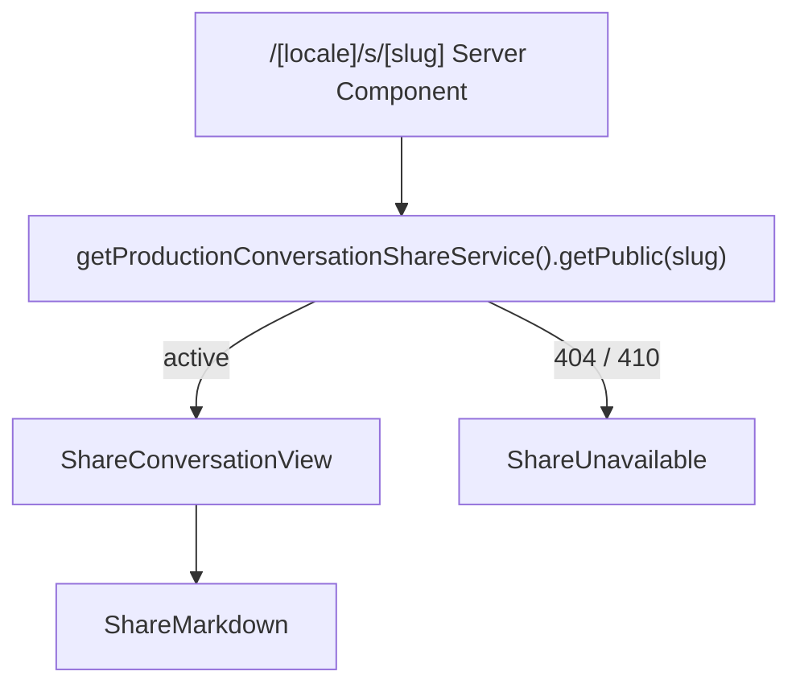

# Near Share SP2：公网匿名只读页面

Planned-with: GPT-5.6 Sol  
Suggested-Impl-Model: Cursor Grok 4.5 High Fast  
Plan-Id: `2026-07-21-near-share-public-page`  
Parent-Plan: `.cursor/plans/2026-07-21-near-public-conversation-sharing.plan.md`  
Depends-On: `.cursor/plans/2026-07-21-near-share-cloud-core.plan.md`

## 目标

基于 SP1 冻结的 `ConversationShareSnapshotV1` 和 share service，在 `www.agxbuilder.com/s/<slug>` 提供不要求登录、不可编辑、不会被搜索引擎收录的安全对话页面。

## 双仓路径约定

- Website-local 文件均相对本独立仓根书写，例如 `src/...`。
- AgenticX 主仓文件使用 sibling 路径，例如 `../desktop/...`。
- 本计划的 Website 实现由 Website commit 落地；任何 Desktop 依赖或验证由 AgenticX 主仓配对 commit 落地，不能假设两仓共享同一 Git commit。

## 前置条件

- SP1 已完成并提交。
- `getProductionConversationShareService().getPublic(slug)`、稳定错误码和 golden fixture 已存在。
- migration 已能在测试数据库运行。

## In scope files

新增：

- `src/app/[locale]/s/[slug]/page.tsx`
- `src/app/[locale]/s/[slug]/loading.tsx`
- `src/components/shares/ShareConversationView.tsx`
- `src/components/shares/ShareMessage.tsx`
- `src/components/shares/ShareMarkdown.tsx`
- `src/components/shares/ShareUnavailable.tsx`
- `src/components/shares/share-rendering.ts`
- `src/components/shares/__tests__/ShareMarkdown.test.tsx`
- `src/components/shares/__tests__/share-rendering.test.ts`

修改：

- `src/i18n/dictionaries/zh.ts`
- `src/i18n/dictionaries/en.ts`
- `src/middleware.ts`
- `package.json`
- `pnpm-lock.yaml`

## Out of scope

- 不改 SP1 API/schema。
- 不改 `../desktop/**`。
- 不添加登录、继续对话、评论、访问计数、分享按钮或附件下载。
- 不复用/修改 `components/docs/markdown-renderer.tsx`，避免影响官网文档。
- 不重构 `[locale]/layout.tsx` 的全站主题。

## 设计基线

页面结构：



视觉原则：

- 沿用官网当前 dark token，不新建主题系统。
- 中央单列，桌面最大宽度约 860px；移动端自然缩放。
- 390px 下页面无横向溢出；长标题、URL、文件名、代码块和 GFM table 只能在内容容器内换行/滚动。
- 标题和“由 Near 分享”品牌信息克制展示。
- user 与 assistant 使用清晰但不过重的层级区分。
- 附件是 metadata 卡片，不是下载链接。

## 实施任务

### Task 1：安装安全 Markdown 依赖并写失败测试

使用包管理器添加最新兼容版本，不手写版本号：

```bash
pnpm add react-markdown remark-gfm rehype-sanitize
```

更新 `test:shares`，将 `src/components/shares` 纳入 Vitest。

先写 `ShareMarkdown.test.tsx`，使用 `react-dom/server::renderToStaticMarkup`，不额外引入 jsdom/testing-library。

必须先出现失败的断言：

- `**bold**`、列表、GFM table、fenced code 正常渲染。
- `<script>alert(1)</script>` 不形成可执行 script 节点。
- `[x](javascript:alert(1))` 不输出 `href="javascript:..."`。
- `data:`、`file:`、`vscode:` 链接不形成可点击 URL。
- `https:`、`http:`、`mailto:` 正常，外链含 `target="_blank"` 与 `rel="noopener noreferrer nofollow"`。
- `` 不生成 ``，也不发第三方请求。

运行：

```bash
pnpm exec vitest run \
  src/components/shares/__tests__/ShareMarkdown.test.tsx
```

### Task 2：实现 `ShareMarkdown`

`ShareMarkdown.tsx`：

- 使用 `react-markdown` + `remark-gfm`。
- 不使用 `rehype-raw`。
- 可以使用 `rehype-sanitize` 的安全默认 schema；若扩展 class，只扩样式属性所需字段，禁止 event handler/style script。
- 在 `share-rendering.ts` 导出纯函数 `safeShareUrl(raw)`：
  - 只返回 `http:`, `https:`, `mailto:`。
  - 相对 URL不允许，因为内容来自 Desktop 且没有可信 base。
  - 非法 URL 返回空字符串，renderer 将其降级为普通文本。
- 覆写 `img` component 为“远程图片未公开”的纯文本占位；任何 Markdown 图片 URL 都不得请求。
- code block 可复用现有 `prism-react-renderer`，但不能修改 docs renderer。
- 对超长无换行文本使用 `overflow-wrap:anywhere`，代码块横向滚动。

不要渲染 Mermaid 或任意 HTML；fenced `mermaid` 当普通代码块显示。

### Task 3：i18n copy

在 zh/en 字典同时新增结构一致的 `share` 节：

```ts
share: {
  pageTitle: string;
  pageDescription: string;
  sharedByNear: string;
  readOnly: string;
  createdAt: string;
  expiresAt: string;
  userLabel: string;
  assistantLabel: string;
  attachmentMetadataOnly: string;
  unavailableTitle: string;
  unavailableDescription: string;
  temporarilyUnavailableTitle: string;
  temporarilyUnavailableDescription: string;
  reload: string;
}
```

中文字面要求：

- 页面品牌：“由 Near 分享”
- 只读提示：“这是创建时保存的只读快照”
- 附件：“原文件未公开”
- 无效态：“链接已失效或不存在”
- 暂时态：“分享内容暂时无法加载，请稍后重试”

英文不得遗留中文 fallback。

### Task 4：消息与会话视图

`ShareMessage.tsx`：

- props 只接受 `ConversationShareMessageV1` 和 locale。
- role=user：显示 `senderLabel || userLabel`。
- role=assistant：显示 `senderLabel || assistantLabel`。
- 不接受 avatar URL；使用现有 UI Avatar 或纯文字圆形占位。
- message content 交给 `ShareMarkdown`。
- attachment 卡只显示：
  - name
  - MIME type
  - human-readable size
  - “原文件未公开”
- attachment 卡不得含 `<a download>` 或远端请求。
- 可选 `createdAt` 使用 `Intl.DateTimeFormat`，无时间时不显示占位。

`ShareConversationView.tsx`：

- 顶部标题、Near 标识、只读说明、创建/失效时间。
- 按 snapshot messages 原顺序渲染。
- 不显示 slug、owner、client request id 或 schema JSON。
- 空 messages 属于服务端契约错误，防御性显示 unavailable，不抛白屏。
- 使用 `<main>` + 唯一 `<h1>`；消息容器使用语义化 list/article，时间使用 `<time dateTime>`，附件有可读 label。

`ShareUnavailable.tsx`：

- 404、410、revoked 使用相同终端文案。
- 不告诉访问者“链接存在但属于谁”。
- terminal variant 始终显示一个次级文本链接“返回官网首页”，不显示登录/恢复入口。
- `variant="temporary"` 时显示“重新加载”按钮；404/410/revoked 的终端 variant 不显示恢复承诺。

### Task 5：公开页面

`src/app/[locale]/s/[slug]/page.tsx`：

```ts
export const dynamic = "force-dynamic";
export const revalidate = 0;
```

- params 类型为 `Promise<{ locale: string; slug: string }>`。
- 使用 `isLocale()` 校验 locale。
- Server Component 直接调用 SP1 service/repository，不 self-fetch `/api/shares/[slug]`。
- 精确调用 `getProductionConversationShareService().getPublic(slug)`；不要自行组装 deps 或另建 repository。
- active → `ShareConversationView`
- `share_not_found` / `share_expired` → `ShareUnavailable`
- 其他配置/数据库异常不得把错误信息塞进 HTML；记录安全日志后显示通用暂不可用状态。
- 页面响应路径不可被静态预生成。

`generateMetadata({ params })` 校验 locale 后读取对应字典的 `share.pageTitle/pageDescription`，返回静态安全 metadata，不把用户消息正文放进 title/description：

```ts
{
  title: dictionary.share.pageTitle,
  description: dictionary.share.pageDescription,
  robots: { index: false, follow: false, nocache: true }
}
```

不要生成包含消息正文的 Open Graph image。

`loading.tsx`：

- 提供不含消息正文的只读加载壳。
- 使用 `aria-busy` 与 `role="status"`。
- 高度稳定，避免页面大幅跳动。

`middleware.ts` 保持现有 locale rewrite，并仅对 `/s/*`、`/en/s/*` 响应增加：

```text
Cache-Control: private, no-store, max-age=0, must-revalidate
Referrer-Policy: no-referrer
Content-Security-Policy: img-src 'self' data:
```

不得改动其他官网路由的 header；补 middleware 定向测试或纯 helper 测试，确保 locale rewrite 仍工作。

### Task 6：页面状态和渲染测试

`share-rendering.test.ts` 覆盖：

- 字节转换 0、KB、MB。
- zh/en 时间格式函数接受有效 ISO。
- 非法时间不抛异常。
- safe URL protocol allowlist。

`ShareMarkdown.test.tsx` 覆盖 Parent Plan AC-11 的 XSS payload。

页面数据状态可把“service error → view state”提取为纯函数并测试：

- active → conversation
- 404/410 → unavailable
- 503 → temporarily unavailable
- zh/en metadata title/description 均使用对应字典且不含用户正文

最终在 SP2 手工/浏览器检查：

- `/s/<slug>` 被 middleware rewrite 到中文页。
- `/en/s/<slug>` 显示英文。
- 未登录隐身窗口可访问 active share。
- 页面没有登录重定向。

## 定向验证

```bash
pnpm test:shares
pnpm ts-check
pnpm lint
pnpm build
```

浏览器验收必须检查：

```text
active share
unknown slug
expired share
revoked share
Markdown script/javascript URL fixture
mobile width 390px
desktop width 1440px
active/invalid/temporary response Cache-Control 均为 no-store
Markdown image 不产生 third-party network request
```

## AC

- AC-SP2-1：匿名 active share 在 `/s/<slug>` 与 `/en/s/<slug>` 可读，不跳登录。
- AC-SP2-2：404、410、revoked 终端页面不泄露记录状态差异或用户身份。
- AC-SP2-3：raw HTML 和危险 URL 不执行、不生成危险 href。
- AC-SP2-3a：Markdown image 不渲染远程资源；share 页面使用 no-referrer。
- AC-SP2-4：附件只有 metadata 和“原文件未公开”，没有下载请求。
- AC-SP2-5：页面 metadata 为 noindex/nofollow，不包含用户消息。
- AC-SP2-6：页面每次动态查询，撤销后不会因 Next/CDN 缓存继续可见。
- AC-SP2-6a：loading、temporary、terminal unavailable 三种状态语义和文案不同。
- AC-SP2-7：zh/en 文案结构一致，Website test/typecheck/lint/build 全绿。
- AC-SP2-8：SP1 API/schema、Desktop、Enterprise 无无关改动。
- AC-SP2-9：键盘/屏幕阅读器语义完整，390px 无页面级横向溢出。

## 提交边界

本 subplan 在 Website 独立仓提交。若 SP2 与 SP3 并行，SP2 从 Website 的 SP1 已验证提交创建 worktree；SP3 在 AgenticX 主仓独立执行。不要在本分支顺手修改 `../desktop/**`；Desktop 改动必须进入主仓配对 commit，两仓提交不共享同一 Git 基线。
