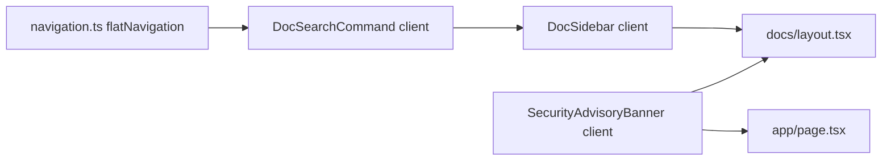

# AgenticX 文档站：搜索与安全横幅

## 落盘位置（按你的要求）

- 在**开始改代码前**，将本计划全文写入：`AgenticX-Website/.plan/2026-03-25-docs-search-and-security-banner.plan.md`（新建目录 `.plan` 若不存在）。
- 说明：仓库根规则偏好 `.cursor/plans/` 用于 Cursor 追踪；本次以 **Website 子项目内** `.plan` 为权威副本。若你希望与 `plan-management.mdc` 双写，可在同一次提交中再链一份到 `.cursor/plans/`（可选，非本需求必选）。

## 背景与根因（已确认）

- 侧栏搜索为无逻辑的占位 `input`（`AgenticX-Website/src/components/docs/sidebar.tsx`）（无 state、无 ⌘K 监听）。
- LiteLLM 警告仅在 `AgenticX-Website/src/app/page.tsx` 首页 `main` 内，`AgenticX-Website/src/app/docs/layout.tsx` 未包含。
- 导航数据已有 `flatNavigation`（`AgenticX-Website/src/components/docs/navigation.ts`）（含 `section`），适合作为命令面板数据源；`AgenticX-Website/src/components/ui/command.tsx` 已封装 `CommandDialog`。

## 实现方案

### A. 文档搜索（cmdk）

1. **扩展导航类型（小范围）**  
   在 `navigation.ts` 为 `DocNavItem` 增加可选字段 `searchAliases`（空格分隔关键词）。仅对需要「标题里不出现但应被搜到」的条目赋值，例如 **LLM Providers** 增加 `litellm`、`LiteLLM` 等。

2. **新建客户端组件** `DocSearchCommand`（`AgenticX-Website/src/components/docs/doc-search-command.tsx`）  
   - `'use client'`；受控 `open` / `onOpenChange`。  
   - `useEffect` 注册 `keydown`：`metaKey`/`ctrlKey` + `k` 时 `preventDefault` 并打开。  
   - 数据源：`docNavigation`；按 `section` 分组渲染 `CommandGroup` + `CommandItem`。  
   - 每个 `CommandItem` 设置 `value` 为可搜索串：`${title} ${slug} ${section} ${aliases}`。  
   - `onSelect`：`router.push(\`/docs/${slug}\`)` 并关闭对话框。

3. **接入侧栏** `sidebar.tsx`  
   - 将占位 `input` 改为可点击 `button`（或 `readOnly` input）打开命令面板。  
   - **⌘K / Ctrl+K** 由 `DocSearchCommand` 内监听。

4. **布局**  
   - `docs/layout.tsx` 保持 Server Component；侧栏内挂载客户端子组件。

### B. LiteLLM 安全横幅（文档区可见）

1. **抽取组件** `AgenticX-Website/src/components/security-advisory-banner.tsx`  
   - `'use client'`，从首页复制文案与链接，样式一致。

2. **引用**  
   - 首页：`<SecurityAdvisoryBanner />` 替换内联块。  
   - 文档：`docs/layout.tsx` 在 `<main>` 内、子内容之上插入同一组件。

### C. 验证

- `pnpm --dir AgenticX-Website build`。  
- 手动：`/docs/index`，⌘K，`litellm` 命中 LLM Providers；文档页顶部可见横幅。

## 非目标（防范围蔓延）

- 不对全站 Markdown 做全文索引或接入 Algolia。  
- 不修改 `docs/[...slug]/page.tsx` 的 `docsMap` 缺失项（除非阻塞构建）。

## 依赖关系简图

