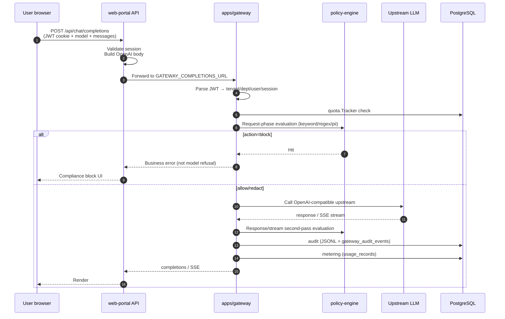
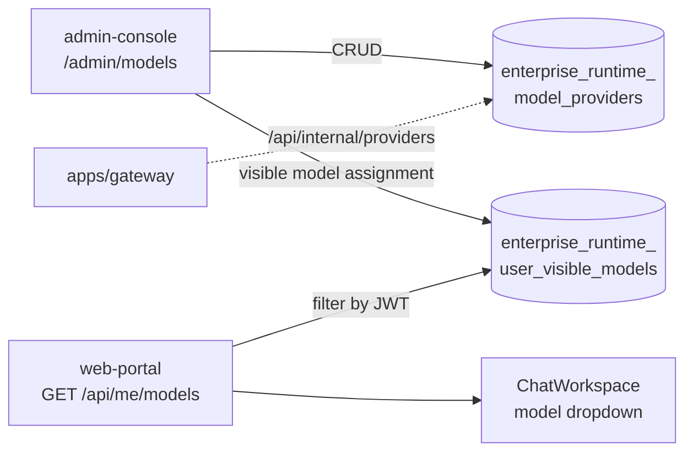
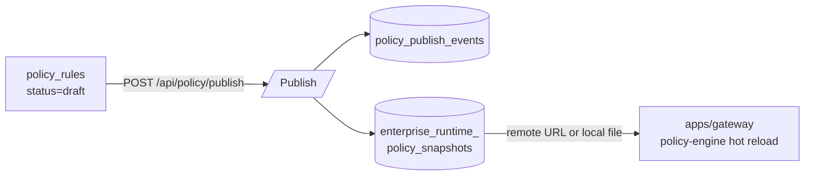
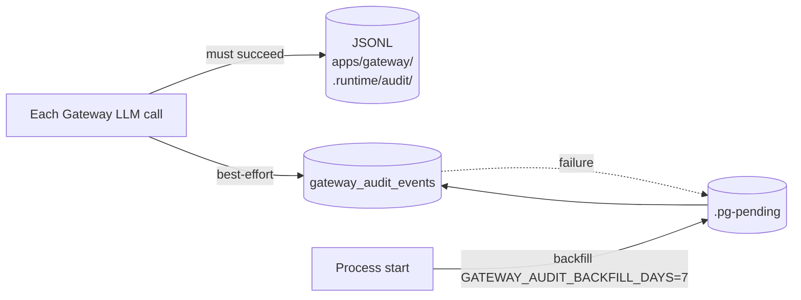
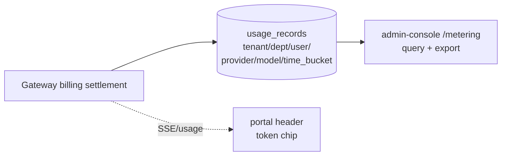
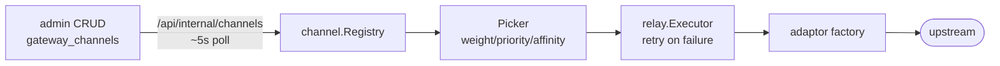
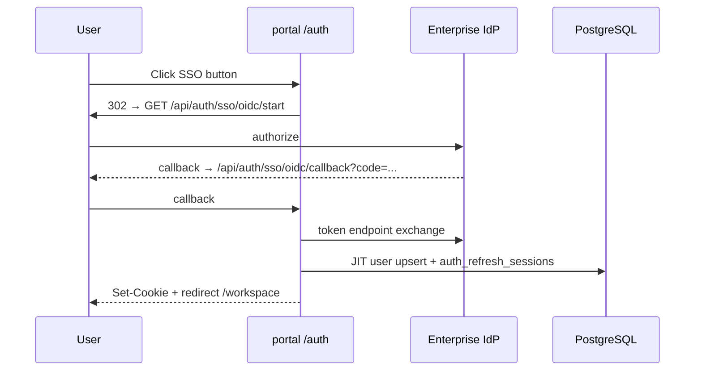

# Enterprise Data Flow

> Last updated: 2026-05-21

This document describes data flow for a complete chat request and related subsystems.

---

## 1. Chat completions main path



### Portal session persistence

Chat history **is not persisted by Gateway**; portal API writes to PG:

- `POST /api/chat/sessions` → `chat_sessions`
- `POST /api/chat/sessions/:id/messages` → `chat_messages`

Gateway handles inference, policy, audit, and metering only.

---

## 2. Model visibility



Portal controls **which model IDs users see**; gateway controls **which upstreams are callable** via internal API or PG provider config.

---

## 3. Policy publish flow



**Note**: `blocked=true` only when action is **block**; warn/redact may have hits without blocking.

Test endpoint: `POST /api/policy/test` merges form preview with DB rules.

---

## 4. Audit dual-write



Admin `/audit` queries PG `PgAuditStore` with scope-based visibility:

- `audit:read:all` — full tenant
- `audit:read:dept` — own department

IAM admin audit lives in a **separate table** `audit_events`.

---

## 5. Token metering



Quotas: `enterprise_runtime_token_quotas` → gateway `quota.Tracker`. Currently **tenant-level**; dept/user TPM requires separate planning.

---

## 6. Channel relay (optional)

When `GATEWAY_CHANNEL_REGISTRY=on`:



See [runbooks/gateway-channel-relay.md](../runbooks/gateway-channel-relay.md).

---

## 7. SSO login flow (OIDC example)



Admin mirrors routes on `:3001`; provider CRUD at `/settings/sso` + `/api/admin/sso/providers/*`.

---

## 8. Legacy JSON migration flow

```
.runtime/admin/*.json  (historical local files)
  ▼
migrate-runtime-legacy.ts  (bootstrap / start-dev auto trigger)
  ▼
enterprise_runtime_* tables
  ▼
admin / portal / gateway read PG only
```
