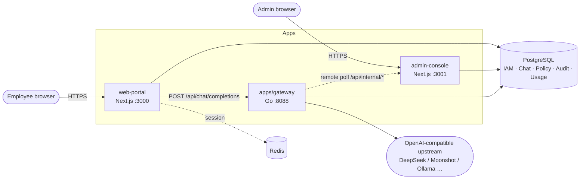

# Enterprise Architecture Overview

## 1. Product positioning

AgenticX Enterprise provides:

1. **Employee portal** — Web chat workspace, model selection, session history
2. **Admin console** — IAM, policy rules, audit, metering, model services, channel management
3. **AI gateway** — OpenAI-compatible API, policy evaluation, audit chain, token metering, multi-upstream routing

The moat is three-tier integration with Machi Desktop (cloud governance + on-device security loop). The business model is **open-source core + customer-specific customization** (`customers/*` private repos).

---

## 2. Component topology



### Ports & processes

| Component | Port | Stack | Workspace |
|---|---|---|---|
| web-portal | 3000 | Next.js 15 | pnpm |
| admin-console | 3001 | Next.js 15 | pnpm |
| gateway | 8088 | Go 1.25 + chi | go.mod (standalone) |
| edge-agent | 7823 (design) | Go skeleton | not in workspace |
| Postgres | 5432 | Docker compose dev | — |
| Redis | 6379 | Docker compose dev | — |

---

## 3. Monorepo layout

```
enterprise/
├── apps/           # Deployable applications
├── features/       # Business domains (primary reuse unit for customers)
├── packages/       # Technical building blocks
├── plugins/        # Runtime manifests (rule-pack, etc.)
├── deploy/         # docker-compose + nginx templates
├── scripts/        # bootstrap / start-dev / E2E
└── docs/           # This documentation tree
```

**pnpm workspace** (`pnpm-workspace.yaml`) includes: `apps/*`, `features/*`, `packages/*`, `plugins/*`, and optional `../customers/*/apps/*`.

**Not in workspace**:

- `apps/gateway` — Go module, built with `go build`
- `packages/sdk-py` — Python, managed via `pyproject.toml`

**Turbo tasks**: `build`, `dev` (persistent), `lint`, `typecheck`, `test`, `clean`.

---

## 4. Layered design

### 4.1 Apps (assembly layer)

Next.js apps own routing, sessions, RBAC middleware, and call into features/packages. Some business stores still live in apps (e.g. `admin-console/lib/*-store.ts`) and are migrating into features.

### 4.2 Features (business domains)

> Legend: ✅ implemented · 🟡 partial · ⚪ stub · ⛔ skeleton

| Feature | Responsibility | Status |
|---|---|---|
| iam | Users / departments / roles / bulk import | ✅ |
| chat | Chat workspace UI + store | ✅ |
| policy | Policy PG storage + snapshot publish | ✅ |
| audit | Gateway audit queries | ✅ |
| metering | Four-dimensional token queries | ✅ |
| model-service | Provider management | ⚪ (logic in admin-console) |
| knowledge-base | Knowledge base | ⚪ |
| tools-mcp | Tools / MCP | ⚪ |
| agents | Agents | ⚪ |
| settings | Settings panel | ⚪ (portal has local components) |

### 4.3 Packages (technical building blocks)

| Package | Responsibility |
|---|---|
| ui | shadcn primitives + OKLCH theme + AppShell |
| auth | JWT, OIDC/SAML, Next middleware |
| db-schema | Drizzle schema + migrations |
| iam-core | PG repos, scope-registry, runtime migration |
| core-api | Cross-app type contracts |
| policy-engine | Go policy engine (gateway dependency) |
| config / branding / telemetry / sdk-* | partially stubbed |

### 4.4 Plugins (rule packs)

YAML manifests define `rule-pack` / `tool-pack` / `theme-pack`. Gateway loads `plugins/moderation-*/manifest.yaml` at startup; admin policy center can publish PG snapshots to extend/override.

---

## 5. Auth & tenant model

- **JWT**: RS256, key pair generated by `bootstrap.sh` into `.local-secrets/`, env vars `AUTH_JWT_PRIVATE_KEY` / `AUTH_JWT_PUBLIC_KEY`
- **Claims**: `tenant_id`, `dept_id`, `user_id`, `session_id`, scopes
- **Portal**: password login + OIDC/SAML SSO; refresh tokens in PG `auth_refresh_sessions` (serverless-safe)
- **Admin**: separate session (`ADMIN_CONSOLE_SESSION_SECRET`) + same SSO entry points
- **Gateway**: validates JWT public key, forwards tenant/dept/user/session to audit and quota

---

## 6. Runtime config single source of truth

The following configs **live in Postgres** (`enterprise_runtime_*` tables):

| Config | PG table | Legacy JSON path |
|---|---|---|
| Model providers | `enterprise_runtime_model_providers` | `.runtime/admin/providers.json` |
| User-visible models | `enterprise_runtime_user_visible_models` | `.runtime/admin/user-models.json` |
| Token quotas | `enterprise_runtime_token_quotas` | `.runtime/admin/quotas.json` |
| Policy snapshots | `enterprise_runtime_policy_snapshots` | `.runtime/admin/policy-snapshot.json` |
| Gateway channels | `gateway_channels` | — |

Legacy JSON is idempotently imported via `pnpm migrate:legacy-runtime`. Gateway polls admin internal API or reads PG/local files every ~5s.

---

## 7. Deployment modes

| Mode | Description |
|---|---|
| Local all-in-one | `start-dev-with-infra.sh`: Docker PG/Redis + three processes |
| Vercel split | portal/admin on Vercel; gateway self-hosted/Fly; `GATEWAY_REMOTE_*_URL` for config |
| Docker prod | `deploy/docker-compose/prod.yml` template (nginx + dual gateway + front/back office) |

Helm chart **not yet provided** (reserved in README architecture diagram).

---

## 8. Related docs

- [data-flow.md](./data-flow.md) — Request path details
- [../apps/README.md](../apps/README.md) — App details
- [../gateway/overview.md](../gateway/overview.md) — Gateway deep dive
- [../database/schema.md](../database/schema.md) — Schema reference
