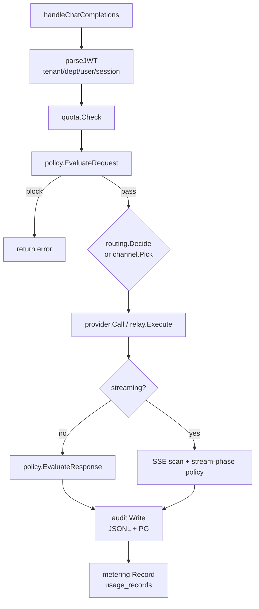

# AI Gateway Architecture

Source: `enterprise/apps/gateway/`  
Module: `github.com/agenticx/enterprise/gateway`

---

## Responsibilities

1. **OpenAI-compatible API** — chat completions + embeddings
2. **Three-route routing** — local / private-cloud / third-party
3. **Channel relay** — multi-upstream weight/priority/retry
4. **Policy engine** — request / response / stream three-channel evaluation
5. **Audit** — JSONL must succeed + PG best-effort + checksum chain
6. **Metering** — usage_records / jsonl
7. **Quota** — tenant-level tracker (TPM/QPM/concurrency, config-driven)

---

## Package layout

```
apps/gateway/
├── cmd/gateway/main.go
└── internal/
    ├── server/           # HTTP entry, handlers
    ├── config/           # YAML + env
    ├── provider/         # OpenAICompatibleProvider
    ├── adaptor/          # Channel adaptor factory
    ├── channel/          # Registry, Picker, Affinity, Stats
    ├── relay/            # Retry executor
    ├── keypool/          # Multi-key pool
    ├── billing/          # Token settlement
    ├── routing/          # Decider (header/model/default route)
    ├── runtimeconfig/    # Remote/local providers polling
    ├── quota/            # Tracker
    ├── metering/         # PG / jsonl sink
    ├── audit/            # Writer, backfill, chain
    └── gatewayinternal/  # HTTP GET + Bearer
```

---

## Chat request processing order



Streaming path performs **stream-phase** policy evaluation and segmented audit during SSE scanning.

---

## Routing decision

`routing.Decider` priority (simplified):

1. Explicit provider request header
2. `local_route_header` configured header value
3. Model config `Models[].route`
4. `default_route`

Route values: `local`, `private-cloud`, `third-party` (aligned with provider table `route` field).

---

## Channel relay

Enable with: `GATEWAY_CHANNEL_REGISTRY=on`

Runbook: [runbooks/gateway-channel-relay.md](../runbooks/gateway-channel-relay.md)

---

## Key resolution priority

1. PG / remote providers decrypt `api_key_cipher`
2. `<PROVIDER>_API_KEY` env var
3. `LLM_API_KEY`
4. Mock placeholder (policy/audit/metering still run)

---

## Audit checksum chain

- Each `gateway_audit_events` row has `checksum`, `prev_checksum`
- Algorithm: Blake2b (see Go struct for field layout)
- Admin `GET /api/audit/chain-verify` validates full table
- PG write failure → `.pg-pending`, backfill on startup via `GATEWAY_AUDIT_BACKFILL_DAYS`

---

## Difference from Python AgenticX gateway

| Capability | Go Enterprise Gateway | Python AgenticX |
|---|---|---|
| 17 secret detectors | partial in plugins | more built into framework |
| LiteLLM routing | no, OpenAI client | yes |
| keyword-list kind | no | may exist |
| extends manifest | single string | depends on loader |

Do not conflate the two lines in customer-facing docs.

---

## Related docs

- [policy-engine.md](./policy-engine.md)
- [runtime-config.md](./runtime-config.md)
- [../api/gateway.md](../api/gateway.md)
